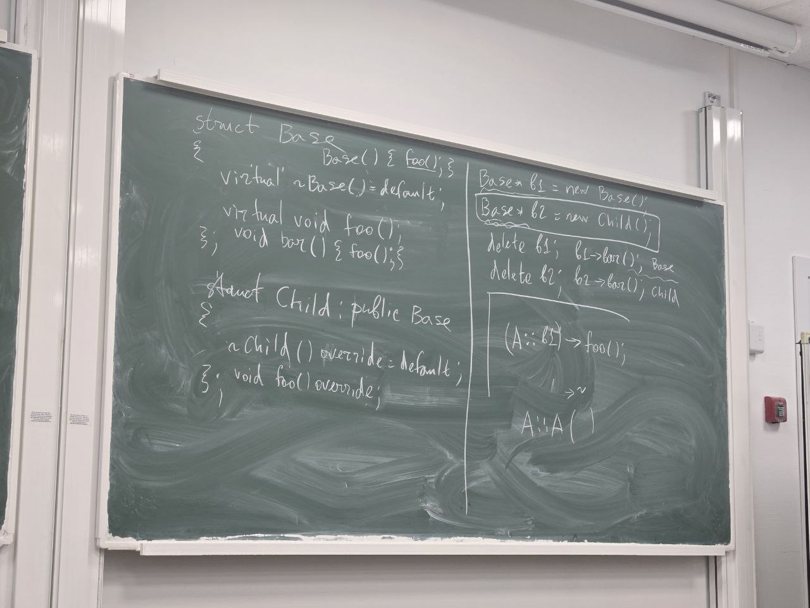

```c++
class Class : virtual B // надо чтобы, не копировались поля из двух классов
```
Если у родителя метод объявлен виртуальным, то до C++11 он автоматически перегружает метод 
родителя

```c++
class Base{
public:
    virtual void foo();       
};

class Child: public Base{
public:
    void foo();
};
```

Если класс полиморфный, надо делать виртуальный деструктор




```c++
class A{
public:
    void func(int);
    void func(double);
};

A* ptr = new A();
void (A::(*int_fptr))(int) = &A::func;
void (A::(*dll_fptr))()(double) = &A::func;
(ptr->*int_fptr)(123);
```

```c++
decltype(&A::func) fptr;
```

```c++
template <class T1, class T2>
auto sum(T1 x, T2 y) -> decltype(x + y){
    //return x + y;
}
```

```c++
Child::Child():Base(1), _x(123){}
Child::Child():Child(2)
```

slice effect

```c++
Child c;

void foo(Base b){
    b.foo();
}

foo(c); // функция foo, если нет &
```

